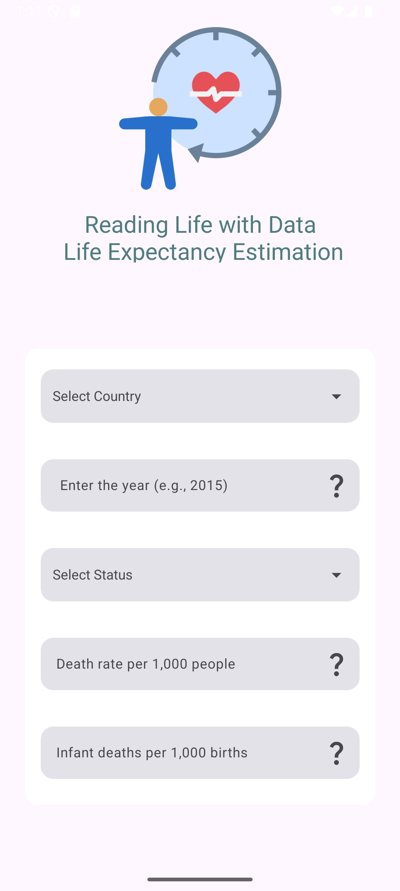
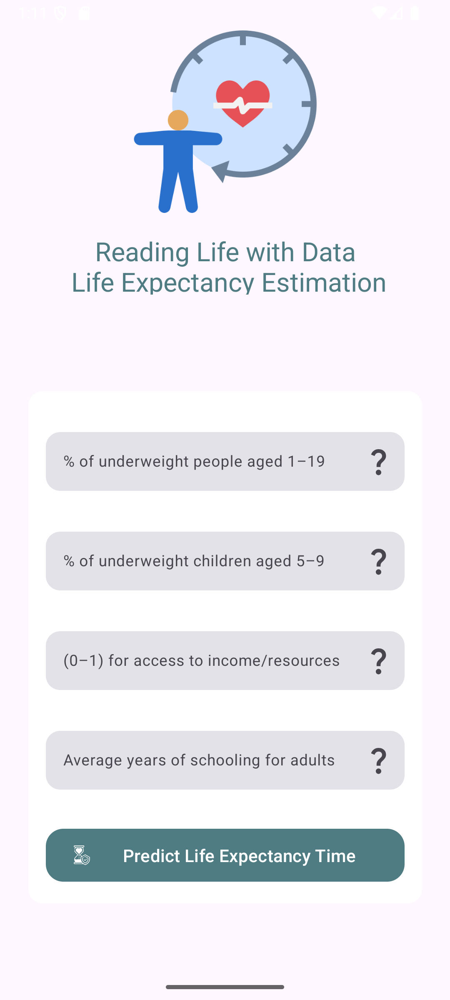

# 📊 Life Expectancy Prediction

A machine learning project that predicts the average life expectancy of a country using health, demographic, and economic indicators.
Includes a Flask API connected to a mobile interface built with Android (Kotlin) for real-time predictions.
Technologies: Python, Pandas, Scikit-learn, Flask, Android (Kotlin)

---

## 🚀 Project Features

- ✅ **Machine Learning Model**:  
  - Algorithm used: `Random Forest Regressor`  
  - Dataset: [WHO Life Expectancy Dataset](https://www.kaggle.com/datasets/kumarajarshi/life-expectancy-who)  
  - Includes data preprocessing, hyperparameter optimization, and model evaluation steps.

- 📱 **Mobile Interface (Android)**:  
  - Developed with Kotlin.  
  - Uses MVVM architecture.  
  - Takes life-related stats from the user and displays predictions via a Flask API.  
  - Designed with a clean and user-friendly UI.

---

## 🧠 Technologies Used

| Category | Technologies |
|----------|--------------|
| Machine Learning | Python, Pandas, Scikit-Learn, RandomForest |
| Backend | Flask, ngrok (for public testing) |
| Mobile App | Kotlin, Retrofit, MVVM, Android XML |
| Development | Google Colab, Android Studio |

---

## 🖼️ Screenshots

<p align="center">
  
  
</p>

---

## 📦 Installation and Usage

### 🧪 1. Machine Learning Model (Flask API)

1. Install required dependencies:
    ```bash
    pip install -r requirements.txt
    ```

2. Start the Flask API server:
    ```bash
    python app.py
    ```

3. To expose your local server to the internet (for mobile testing), use `ngrok`:
    ```bash
    ngrok http 5000
    ```

4. Copy the generated URL and update it as the base URL in the mobile app.

---

### 📱 2. Mobile App (Android)

1. Open `MobileAPP-User-Interface/LifeExpectancy` in Android Studio.
2. In `RetrofitInstance.kt`, update the `BASE_URL` with the Flask server address.
3. Make sure your emulator or physical device has internet access.
4. Run the app and fill the form to get a life expectancy prediction.
